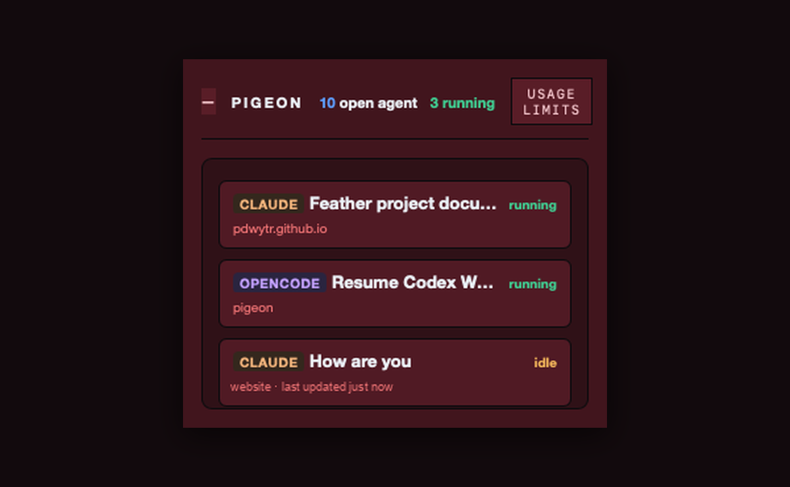
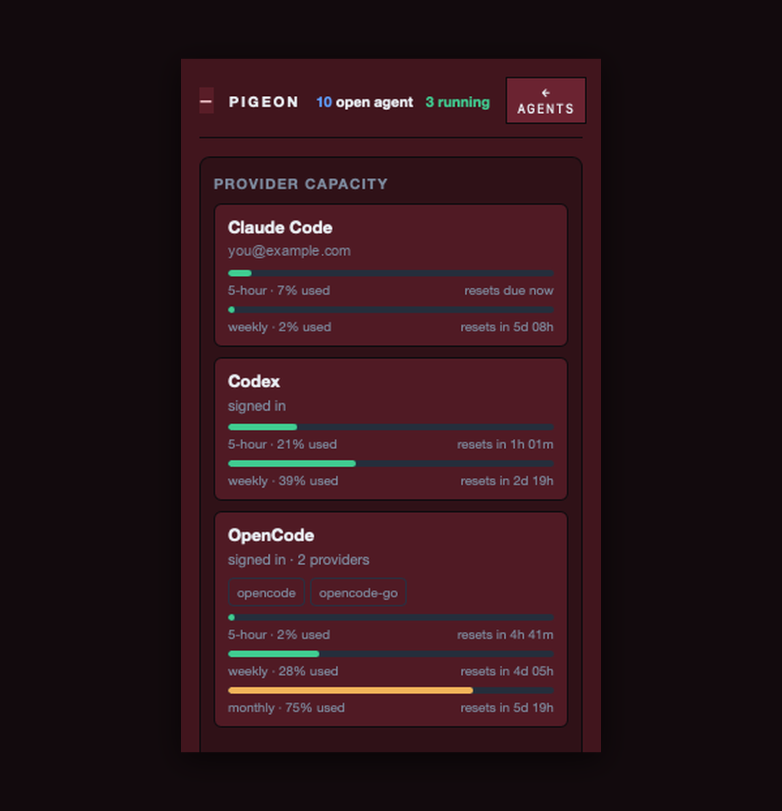

I started an agent on a large refactor and went off to do something else, and a few minutes in it blocked on a permission prompt and just sat there. I came back an hour later expecting the whole thing to be done, and it hadn't even started.

It isn't that a notification failed to reach me, because there was never going to be one in the first place. An agent that's blocked on a permission prompt and an agent that's halfway through the work look exactly the same from the outside — both are a still pane you aren't currently looking at — so you assume it's running and you go do something else.

Multiply that across three engines and a dozen panes and you're not really tracking any of them, you're just assuming.

[Pigeon](https://github.com/pdwytr/pigeon) is a 322-pixel window that sits on top of everything and tells you which one is waiting.



---

## What it does

Claude Code, Codex and OpenCode all write their sessions to disk as they work — JSONL transcripts under `~/.claude`, rollout files under `~/.codex`, a live SQLite database for OpenCode. All three also leave evidence of the *running process*: a status file, a held lock file, an open row.

Pigeon reads all of it and writes to none of it. Three formats become one list with one vocabulary: **running**, **needs you**, **finished**.

It is local-only. The only network call it makes is the usage endpoint Claude Code itself calls, with Claude Code's own token.

## Using it with tmux

Pigeon doesn't know what tmux is — it reads the engine's own files, so it works the same whether your agents are in tmux panes, separate terminal windows, or tabs you've lost track of. What tmux changes is what you can do once you know, because there the jump is a single command.

The setup is just: run your agents however you already do, and name each tmux session after the project directory.

```bash
tmux new-session -d -s website -c ~/Projects/website
```

Pigeon puts the project leaf on every row. So when a row says `CLAUDE · website · needs you`, the jump is direct:

```bash
tmux switch-client -t website
```

No integration, no config, nothing to install on the tmux side. Pigeon reads the working directory out of the engine's own files, so as long as the tmux session name matches the folder, the row tells you where to go. If you prefer `<prefix> s` and picking from the list, that works too — the point is that you now know *that* you need to switch, which is the part tmux cannot tell you.

## Allowances

The second thing it shows is how much of each subscription is left, one click from the list.



Every engine reports limits differently. Claude Code has a five-hour and a weekly window. Codex states its rate limits inside its own rollout files. OpenCode reports per-provider allowances including a monthly one. Where an engine publishes nothing, the panel says so instead of drawing a bar at zero.

---

## Absence is four different things

That's the rule the rest of the product follows from, and the refactor is the simplest version of it: nothing was moving on screen, so I read nothing as fine.

The same thing happens with numbers, where it's harder to catch, because a missing value and a zero look identical once you render them the same way. If a field disappears because an engine changed its format and the reader quietly substitutes a default, you get a usage bar sitting at zero that reads as plenty of room when the truth is that nobody knows. That one hasn't caught me, and I'd rather it didn't: engines change their formats on their own schedule, and a bar reading zero when it means "unknown" is the sort of thing you'd only discover by running out of something you thought you had.

So four states, rendered four ways:

| State | Means | Shows as |
|---|---|---|
| null | the engine stated nothing | no chip |
| pending | not counted yet | "Counting…" |
| unavailable | tried, couldn't | the reason, plus *Try again* |
| zero | counted, it's zero | `0` |

A ratio with a zero denominator is undefined, not zero. A session whose engine could not be read gets no status badge at all, rather than "finished" — an empty list that looks like an idle machine is the one way this thing can lie to you.

## The counting is the hard part

Six counters per session — input tokens, output tokens, cache read, cache write, API calls, tool calls — and three ratios:

```text
context per call = cache_read  ÷ api_calls
rewrite ratio    = cache_write ÷ cache_read
batching ratio   = tool_calls  ÷ api_calls
```

Each one has a trap that produces a plausible wrong number rather than an obvious error.

**Claude Code's `output_tokens` is a streaming counter.** It grows line by line as one message is written. Summing the records double-counts by two to six times. Reading the first occurrence under-counts. The rule is to dedupe by `message.id` and take the element-wise maximum within each id.

**Codex's `input_tokens` already includes its cached portion.** One session measured 12,208,937 input tokens, of which 11,544,064 were cached. Claude reports those two as disjoint. Passing Codex's number through unchanged double-counts the cached prompt and makes a Codex row incomparable with a Claude row in the same total, so Pigeon subtracts.

**Codex's totals are cumulative.** The last event is already the session total. Adding the events multiplies the answer by the number of turns.

And no invented dollar figures. Claude and Codex are subscription logins; a per-token price for a subscription is fiction. OpenCode publishes its own cost, so that one is shown as the engine's number. Everything else is tokens.

## Architecture

Tauri v2. A Rust host, a React view, no Python, no sidecar, no database of its own.

```text
src-tauri/src/
  domain/      provider-neutral: keys, metrics, status, projects
  adapters/    one file per engine; nothing above knows their formats
  services/    discovery, metrics, status, accounts, consoles
  api/         commands, DTOs, events, typed errors
src/           React view; src/bindings.ts is the wire contract
```

The line that matters is between `adapters/` and everything above it. One file per engine. The view has no engine-specific branches and renders whatever the adapters report. A fourth engine is one new file, and there is a test asserting that removing one leaves the others untouched.

Some of what's underneath:

**Reading a file beats asking the engine.** Claude Code ships `claude agents --json`, which returns the live set in about 182 ms. Pigeon doesn't call it. Reading the status file the CLI already wrote costs about 0.03 ms, and a subprocess can prompt, can block on the network, and its arguments belong to the engine to change.

**Process attribution is never guessed.** Codex holds a lock file whose filename is the thread id. Claude Code's status file names its own session. Where there's no such proof, a matching working directory isn't evidence — two sessions can run in one folder — so the answer is "ambiguous" and Pigeon claims nothing. No diagnostic string may contain a command line, because a command line can contain your prompt.

**Read-only is tested, not asserted.** One test fingerprints every file under all three engine roots, runs the full discovery and counting pass, and asserts the fingerprints byte-for-byte after. The one permitted exception is SQLite's shared-memory index, which any WAL reader has to register in. It's gated, so a machine with no engines installed still has a green suite.

**A session is `(provider, sid)`, never `sid` alone.** Two engines can mint the same UUID. And never a prefix — these are UUIDv7, whose first eight hex characters only advance every 65 seconds or so.

**Credentials have one exit.** `Secret::expose()` appears once outside tests. A test plants a known dummy token in the credentials fixture and proves it appears in no payload, log or error string.

## What it isn't

No transcript viewer, no search, no history, no charts. The rows are display-only, so Pigeon will tell you which pane to go to but it won't resume anything for you. It doesn't show which model a session is using and doesn't estimate dollars for subscription engines. There are about 280 Rust tests and 130 view tests behind it.

macOS is the verified platform; Windows and Linux compile but aren't exercised. Not signed or notarized yet.

```bash
git clone https://github.com/pdwytr/pigeon
cd pigeon && npm install && npm run tauri dev
```

You need Rust stable, Node 20+, and whichever engines you use on your PATH. Pigeon never bundles or updates a CLI — it launches the ones you installed.

What's changed for me is small but constant: I catch a blocked agent when it blocks rather than an hour later, and I can see where each subscription stands without going and looking for it. Across a few weeks of running several agents at once, that has added up to a lot of hours I'd otherwise have spent waiting on something that wasn't running.
