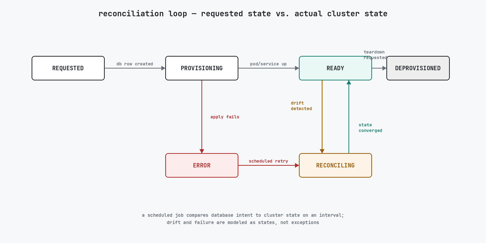

## Problem

Standing up an isolated analytics environment — a SAS Studio pod and its supporting services, scoped to one user or team — was a manual process that took days. Someone had to provision compute, wire up storage, configure access, and confirm everything came up correctly, all by hand, before an analyst could start working.

## Constraints

The users were pharmaceutical clients, which shaped what "done" meant:

- **Access control and audit-friendly operations.** Every environment had to be attributable to a specific request, and every state change had to be something you could account for after the fact, not just something that happened silently in a cluster.
- **Kubernetes state drifts from database intent.** The database is the source of truth for what *should* exist; the cluster is the source of truth for what *does* exist. Left alone, those two views diverge — a pod dies, a manual `kubectl` edit lands, a partially-applied change gets stuck — and nothing notices.

## Design

Each environment carries an explicit operational state — stored in the database rather than inferred from cluster objects — moving through phases such as requested, provisioning, ready, and error as it's stood up, used, and torn down. A scheduled reconciliation loop, built on APScheduler, runs on an interval and compares the database's requested state against what the cluster actually reports, applying whatever changes are needed to close the gap. Failure is modeled the same way as everything else: a failed apply moves the environment into an explicit error state that the next reconciliation pass picks up and retries, instead of raising an exception that some human has to notice and clear by hand. The diagram below illustrates the shape of that loop:

The React and Material UI frontend gives operators visibility into current state per environment without needing to inspect the cluster directly.

## Outcome

Secure provisioning went from days of manual setup to minutes, driven entirely by the reconciliation loop rather than a person running through a checklist. The platform supported about 1,000 concurrent users at 99.9% availability, and this pattern underpinned managed analytics adoption across four pharmaceutical client contracts.
